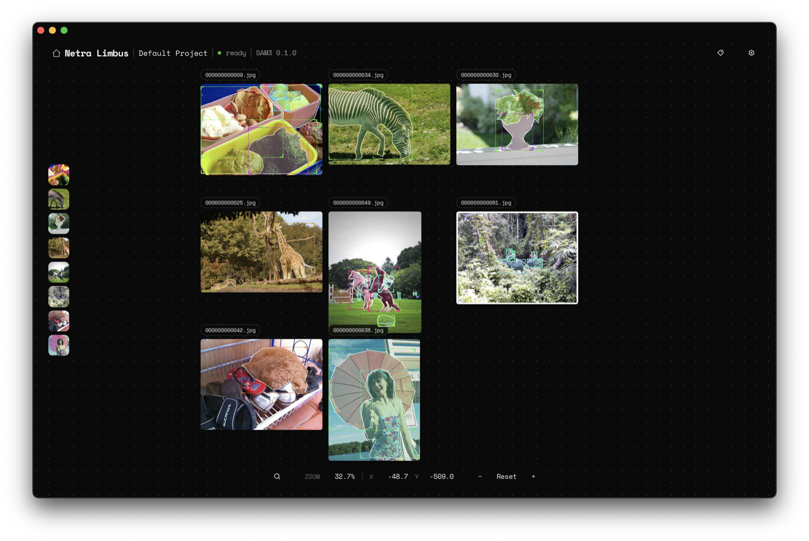
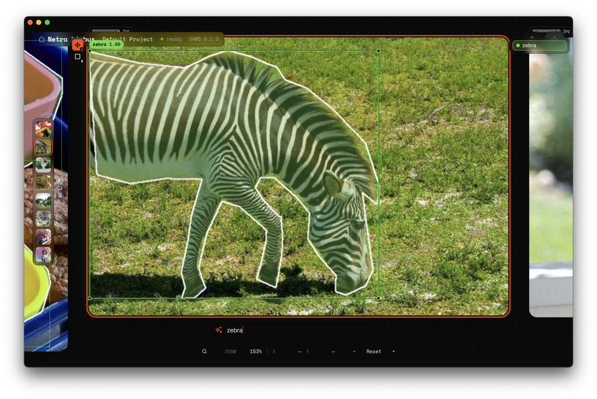

# Netra Limbus

**Annotate image segmentation data — fast, and on your own machine.**

Netra Limbus is a desktop app for building image **segmentation** datasets. Drop images onto an infinite canvas and segment them with [SAM3](https://github.com/rifkybujana/sam3.c) — click a point, drag a box, or type what you want ("zebra") — then label the masks.

It's **local-first**: your images and annotations never leave your machine, and segmentation runs on-device (Metal/Accelerate on macOS), so it's fast with no per-image cloud cost.

Built on [**SAM3.c**](https://github.com/rifkybujana/sam3.c) — a pure C port of Segment Anything 3 — by the team behind [**Kolosal AI**](https://kolosal.ai).

This monorepo hosts the desktop app (plus a web debug build) along with shared design-system and tooling packages. The marketing site lives at [netrart.com](https://netrart.com).



Drop images onto the canvas and SAM3 segments them in place. Prompt by text to get an instant, high-confidence mask and label:



## What you can do

- **Segment with SAM3** — click a point, drag a box, or type a text prompt to get a mask in place.
- **Label & refine** — name masks, manage tags, and edit segmentations.
- **Work at scale** — an infinite, multi-project canvas with undo/redo and level-of-detail rendering for large image sets.
- **Bring your data** — drag in images, folders, or zips, and import existing annotations (e.g. COCO).
- **Stay local** — images, masks, and labels live on your machine in an embedded database; nothing is uploaded.

Image segmentation annotation is what Netra Limbus does — there's no training, deployment, or cloud step. It's a focused tool for producing high-quality segmentation labels.

## Who it's for

- **ML engineers & researchers** building computer-vision datasets who need precise segmentation masks, fast.
- **Teams** labeling proprietary image data that can't be sent to a third-party cloud annotation service.
- **Anyone** who wants SAM3-quality segmentation annotation that runs entirely on their own machine.

## Layout

```
apps/
  app/             # infinite canvas, Tauri desktop + web debug build
packages/
  design-system/   # tokens, CSS kit, self-hosted fonts, brand assets
  tsconfig/        # shared TypeScript base config
pb/                # PocketBase migrations + canonical binary
scripts/           # dev helpers (start PB, stage PB for Tauri, migrations)
docker/            # Dockerfiles + nginx.conf for the web deploy
```

## Prerequisites

- **Node.js 20+** (pinned via `.nvmrc`)
- **pnpm 9** (enable with `corepack enable`)
- **Rust toolchain** (desktop build only). See [tauri.app/start/prerequisites](https://tauri.app/start/prerequisites/).
- **Docker** (optional, for the self-hosted web stack)

## Install

```bash
pnpm install
cp .env.example .env
```

## Run the app in the browser (debug)

```bash
pnpm db:start
pnpm dev:app      # Vite on :5174
```

Visit `http://localhost:5174/`. This is a dev-only web build of the canvas. Production is the Tauri desktop app.

## Run the desktop app

```bash
pnpm tauri:dev
```

This stages the PocketBase binary into `apps/app/src-tauri/binaries/`, then launches the Tauri webview pinned to the canvas.

## Build

```bash
pnpm build        # canvas web bundle → apps/app/dist/
pnpm tauri:build  # native installer for the current platform
```

## Self-hosted web stack

```bash
docker compose up -d
```

Serves the canvas web debug build on `:8081` with PocketBase behind nginx. Data persists in the `pb_data` named volume. `docker compose down -v` wipes state.

## Database

Migrations live in `pb/pb_migrations/`. Apply them locally with:

```bash
pnpm db:migrate
pnpm db:superuser  # create an admin account
```

The SQLite DB, uploaded files, and generated types sit under `pb/pb_data/` (gitignored).

## Contributing

Small team, fast cadence. Before opening a PR:

- Run `pnpm install` after pulling, in case lockfile or workspace deps changed.
- Keep changes scoped. One concern per PR makes review faster for everyone.
- If you're touching the design system, double-check that the Tauri build still renders correctly. Web debug and desktop don't always behave identically.
- Todos and discussion live on Discord. If a change is non-obvious, link the thread in your PR description.

## License

Licensed under the [Apache License, Version 2.0](LICENSE). Third-party
attributions are listed in [NOTICE](NOTICE).